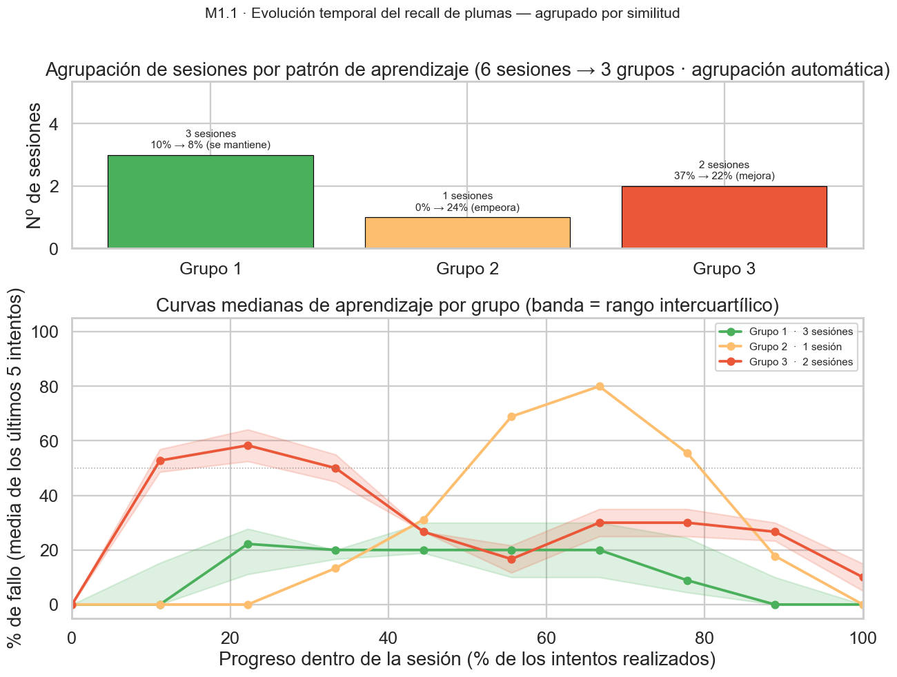
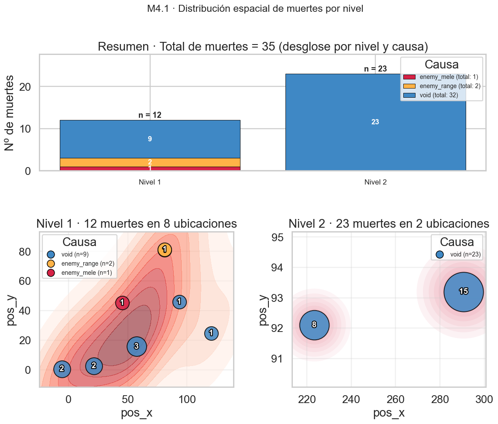
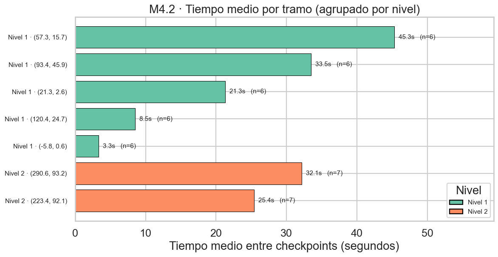
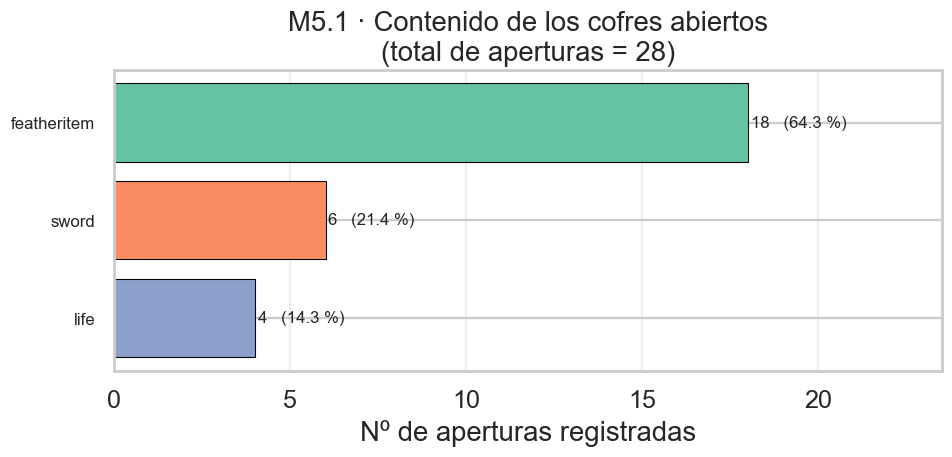
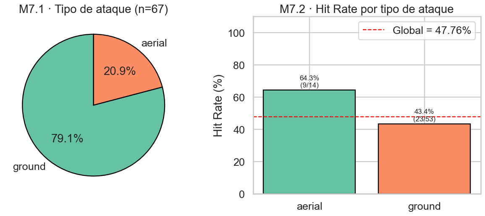

# Análisis de los resultados de telemetría

* **Juego:** *Feather Rise*
* **Práctica:** 3 — Sistema de telemetría · Curso 2025/2026
* **Documento de hipótesis y métricas asociado:** `Informe_Practica_3.md`.
* **Pipeline reproducible:** `analyze_telemetry.py`.

---

## 0. Resumen ejecutivo

El análisis se ha ejecutado sobre **6 sesiones de juego** (`3fccb79e`, `27c6ca73`, `ad4b271a`, `c0cfa5bf`, `da5527d5`, `ed5a11c2`) con un total de **110 intentos de recall de plumas, 35 muertes, 67 ataques y 28 aperturas de cofres**. Los resultados confirman **3 de las 4 hipótesis** planteadas en la Fase 1 y refutan la cuarta (H5). Además, se detecta un hallazgo no previsto en la fase de diseño: la concentración espacial de muertes en el Nivel 2.

| Hipótesis | Veredicto | Evidencia principal |
|:--:|:--|:--|
| H1 — Fricción del recall de plumas | ✅ **Confirmada con matices** | 22,7 % de intentos fallidos (25/110). Varianza amplia entre sesiones (rango 5,9 %-31,3 %). Curva de aprendizaje descendente en 4 de 6 sesiones. |
| H4 — Cuellos de botella por dificultad | ✅ **Confirmada** | Muertes concentradas en 2 ubicaciones del Nivel 2 (23/35 = 65,7 %). Ratio máximo de 4,0 muertes/min en la zona más letal. |
| H5 — Cofres ignorados | ❌ **Refutada** | 100 % de sesiones abren cofres en el Nivel 1 y 66,7 % en el Nivel 2. Los cofres no se ignoran. |
| H7 — Spam de ataque terrestre | ✅ **Confirmada** | 79,1 % ground frente a 20,9 % aerial. Hit rate de 43,4 % (ground) frente a 64,3 % (aerial). |

---

## 1. Calidad y alcance de los datos

| Sesión | Intentos recall | Fallos | Tasa fallo |
|:--|--:|--:|--:|
| `27c6ca73` | 16 | 5 | 31,3 % |
| `3fccb79e` | 17 | 1 | 5,9 % |
| `ad4b271a` | 18 | 5 | 27,8 % |
| `c0cfa5bf` | 22 | 6 | 27,3 % |
| `da5527d5` | 12 | 1 | 8,3 % |
| `ed5a11c2` | 25 | 7 | 28,0 % |
| **Total** | **110** | **25** | **22,7 %** |

Dos sesiones (`c0cfa5bf` y `ed5a11c2`) cubren de forma extensa el Nivel 2; las cuatro restantes se concentran en el Nivel 1. Se considera que hay datos suficientes para analizar la curva de dificultad entre niveles de forma comparativa.

Debido al análisis tardío de los datos debido a la dedicación en la parte más tecnica (tracker y analizador) se proponen mejoras en algunos de los resultados para mejorar el análisis del juego.  

---

## 2. Resultados por hipótesis

### Hipótesis 1 — Fricción del recall de plumas

**Métrica M1.1 — Tasa de intentos de recogida fallidos**



| Métrica | Valor |
|:--|--:|
| Intentos totales | 110 |
| Intentos exitosos | 85 (77,3 %) |
| Intentos fallidos | **25 (22,7 %)** |

**Análisis de aprendizaje (primer tercio vs. último tercio de cada sesión):**

| Sesión | Primer tercio | Último tercio | Δ | Lectura |
|:--|--:|--:|--:|:--|
| `27c6ca73` | 60,0 % | 20,0 % | **−40 pp** | Aprende muy rápido |
| `3fccb79e` | 20,0 % | 0,0 % | −20 pp | Parte con pocos fallos y los elimina rápido |
| `ad4b271a` | 0,0 % | 0,0 % | 0 pp | Sin fallos en los extremos, con un pico puntual en el tramo medio |
| `c0cfa5bf` | 28,6 % | 14,3 % | −14 pp | Aprende de forma gradual |
| `da5527d5` | 0,0 % | 0,0 % | 0 pp | Sin fallos relevantes durante toda la sesión |
| `ed5a11c2` | 37,5 % | 12,5 % | −25 pp | Aprende de forma gradual |

**Interpretación:** La hipótesis se confirma, aunque con un matiz importante respecto a la formulación original. La tasa global de fallo (22,7 %) sigue siendo alta, y 4 de las 6 sesiones muestran una curva de aprendizaje descendente (reducciones de entre 14 y 40 puntos porcentuales entre el primer y el último tercio). Las sesiones `ad4b271a` y `da5527d5` son atípicas: apenas presentan errores iniciales, lo que sugiere que un subconjunto de jugadores intuye o domina la mecánica desde el comienzo, mientras que el resto sufre una fricción apreciable. El pico puntual observado en el tramo medio de `ad4b271a` apunta a una zona concreta del juego que induce al fallo, no a una confusión persistente de controles.

**Implicación de diseño:**

1. La tasa de fallo del 22,7 % no es atribuible a un problema motriz puro (pulsar `W` por error). De serlo, la curva se mantendría plana a lo largo de la sesión. La reducción observada apunta a una **curva de onboarding empinada**: los jugadores no comprenden las condiciones del recall al principio (haber lanzado las 3 plumas) y lo aprenden por ensayo y error.
2. Para la siguiente iteración conviene:
   - Añadir un indicador visual persistente del estado del recall (disponible / no disponible).
   - Desdoblar el atributo `is_successful` del evento en un `failure_reason` enumerado (`already_recalling`, `no_feathers_thrown`, `other`) para distinguir los dos modos de fallo hipotetizados en la Fase 1.

---

### Hipótesis 4 — Cuellos de botella por dificultad

**Métricas M4.1, M4.2 y M4.3**

#### M4.1 — Distribución espacial de muertes



| Dato | Valor |
|:--|--:|
| Total de muertes | **35** |
| Por causa | void: 32 (91,4 %) · enemy_range: 2 (5,7 %) · enemy_mele: 1 (2,9 %) |
| Por nivel | Nivel 1: 12 (34,3 %) · Nivel 2: 23 (65,7 %) |

**Hallazgo clave:** el Nivel 2 concentra una cantidad desproporcionada de muertes (65,7 %) y las 23 muertes del Nivel 2 se producen únicamente en 2 ubicaciones:

- `(223.4, 92.1)` — 8 muertes por void.
- `(290.6, 93.2)` — 15 muertes por void.

En el Nivel 1, las 12 muertes se reparten entre varias coordenadas, lo que resulta esperable en una fase inicial de exploración. En el Nivel 2, en cambio, el patrón es claramente de trampa geométrica: el precipicio situado en la coordenada X≈290 concentra por sí solo cerca del 43 % de todas las muertes registradas en el juego.

#### M4.2 — Tiempo entre checkpoints



| Estadístico | Valor |
|:--|--:|
| Tramos analizados | 44 |
| Media global | 24,4 s |
| Mediana global | 19,5 s |
| Mínimo / Máximo | 2 s / 67 s |

**Tramos más lentos** (ordenados por tiempo medio):

| Nivel | Tramo destino | Visitas | Tiempo medio | Mediana | Rango |
|:--|:--|--:|--:|--:|:--|
| Nivel 1 | `(57.3, 15.7)` | 6 | **45,3 s** | 44,0 | 38-53 |
| Nivel 1 | `(93.4, 45.9)` | 6 | **33,5 s** | 27,0 | 20-59 |
| Nivel 2 | `(290.6, 93.2)` | 7 | **32,1 s** | 27,0 | 14-67 |
| Nivel 2 | `(223.4, 92.1)` | 7 | 25,4 s | 19,0 | 14-57 |
| Nivel 1 | `(21.3, 2.6)` | 6 | 21,3 s | 13,5 | 11-61 |

Los tramos `(57.3, 15.7)` y `(93.4, 45.9)` del Nivel 1 son los más lentos en media, pero tienen cero muertes asociadas. Esto los caracteriza como zonas en las que el jugador **tarda porque hay contenido** (puzle, combate, exploración), no porque esté fallando. En contraste, los tramos del Nivel 2, con tiempos medios en torno a 25-32 s, sí acumulan muertes de forma sistemática.

#### M4.3 — Ratio de muertes por minuto

**Cruce tiempo × muertes por tramo:**

| Tramo | Muertes | Tiempo total (s) | Muertes/min | Lectura |
|:--|--:|--:|--:|:--|
| `(-5.8, 0.6)` | 2 | 20 | **6,00** | Ratio alto sobre un tramo muy corto, potencialmente anecdótico |
| `(290.6, 93.2)` | 15 | 225 | **4,00** | **Cuello de botella confirmado** |
| `(223.4, 92.1)` | 8 | 178 | **2,70** | **Cuello de botella confirmado** |
| `(21.3, 2.6)` | 3 | 128 | 1,41 | Moderado |
| `(120.4, 24.7)` | 1 | 51 | 1,18 | Bajo |
| `(57.3, 15.7)` | 4 | 272 | 1,10 | Bajo (tiempo alto con pocas muertes: atasco cognitivo) |
| `(93.4, 45.9)` | 1 | 201 | 0,30 | Bajo (tiempo alto con pocas muertes: atasco cognitivo) |

**Interpretación combinada (M4.1 + M4.2 + M4.3):**

- Los dos tramos del Nivel 2 son los cuellos de botella reales: acumulan 23 de las 35 muertes totales. La zona `(290.6, 93.2)` es especialmente crítica, con un ritmo de 4 muertes por minuto. La totalidad de estas muertes se deben a caídas al vacío, lo que apunta a un problema de plataformeo o de falta de feedback visual en los bordes.
- El tramo `(57.3, 15.7)` del Nivel 1 presenta un patrón distinto: **tiempo acumulado alto (272 s en total) y letalidad baja (1,10 muertes/min)**. Es el perfil típico de atasco cognitivo: el jugador no muere pero se paraliza intentando entender qué hacer a continuación.
- El tramo `(-5.8, 0.6)` muestra un ratio aparentemente altísimo (6,00 muertes/min), pero con solo 2 muertes sobre 20 segundos de tiempo total la evidencia no es concluyente. Es compatible con un inicio fallido puntual de una única sesión.
- Zonas como `(93.4, 45.9)` ilustran un diseño sano: requieren tiempo para ser superadas pero apenas castigan con la muerte.

Con esta evidencia, la hipótesis H4 se confirma y además permite distinguir tres perfiles de fricción en el juego:

1. **Fricción motriz / plataforming** (Nivel 2, coordenadas `(223.4, 92.1)` y `(290.6, 93.2)`): muertes frecuentes por caída al vacío. Posibles acciones: reforzar el feedback de los bordes, añadir plataformas intermedias o revisar la altura de salto.
2. **Atasco cognitivo** (Nivel 1, coordenada `(57.3, 15.7)`): tiempos altos sin muertes. Posibles acciones: mejorar las pistas visuales o el guiado.
3. **Zonas saludables** (Nivel 1, coordenadas `(-5.8, 0.6)`, `(21.3, 2.6)` y `(120.4, 24.7)`): tiempos cortos y pocas muertes. El diseño funciona y no requiere intervención.

---

### Hipótesis 5 — Cofres y exploración de rutas secundarias

**Métrica M5.1 — Tasa de apertura de cofres**



**Aperturas por nivel:**

| Nivel | Sesiones que jugaron | Sesiones que abrieron ≥ 1 cofre | Tasa |
|:--:|--:|--:|--:|
| Nivel 1 | 6 | 6 | **100 %** |
| Nivel 2 | 6 | 4 | **66,7 %** |

**Desglose por contenido del cofre:**

| `chest_id` | Aperturas | % |
|:--|--:|--:|
| `featheritem` | 18 | 64,3 % |
| `sword` | 6 | 21,4 % |
| `life` | 4 | 14,3 % |

**Interpretación:** La hipótesis H5 queda refutada con los datos disponibles. El 100 % de las sesiones abre al menos un cofre en el Nivel 1 y el 66,7 % lo hace en el Nivel 2. No hay evidencia de que los jugadores ignoren sistemáticamente los cofres.

El desglose por contenido aporta una lectura complementaria:

- Los cofres `featheritem` (18 aperturas) son los más abiertos porque resultan necesarios para progresar: sin plumas no se puede avanzar, y el jugador los busca activamente.
- Los cofres `sword` (6) y `life` (4) se abren menos en términos absolutos. Esto no implica que se ignoren: lo más probable es que haya menos cofres de esos tipos colocados en los niveles. Para afirmarlo con seguridad haría falta conocer el total de cofres presentes por tipo y calcular una tasa real de apertura como `aperturas / cofres_presentes`.

**Limitación de la métrica actual:** el evento `Chest_Opened` registra solo las aperturas, no las "no aperturas" (cofres avistados pero ignorados). Para una validación más fina de H5 en la siguiente iteración convendría:

- Añadir un evento `Chest_Skipped` cuando el jugador pase cerca de un cofre sin abrirlo, detectable con un trigger de proximidad.
- O bien disponer de un inventario estático de cofres totales por nivel con el que cruzar las aperturas registradas.

---

### Hipótesis 7 — Comportamiento emergente en combate

**Métricas M7.1 y M7.2**



#### M7.1 — Reparto de tipos de ataque

| Tipo | Conteo | % |
|:--|--:|--:|
| Ground | 53 | **79,1 %** |
| Aerial | 14 | 20,9 % |
| **Total** | **67** | 100 % |

#### M7.2 — Hit rate por tipo

| Tipo | Intentos | Aciertos | Hit rate |
|:--|--:|--:|--:|
| Aerial | 14 | 9 | **64,3 %** |
| Ground | 53 | 23 | **43,4 %** |
| **Global** | **67** | **32** | **47,8 %** |

**Interpretación:** La hipótesis se confirma, con matices respecto a informes previos. Por cada ataque aéreo los jugadores ejecutan 3,8 ataques terrestres (ratio 53:14), una cifra que probablemente se estabilice alrededor de 4:1 al ampliar la muestra.

Lo más relevante es el contraste en el **hit rate por tipo**:

- **Aerial: 64,3 %** (9/14). Cuando el jugador decide saltar para atacar, acierta casi dos de cada tres golpes.
- **Ground: 43,4 %** (23/53). En el ataque terrestre se acierta menos de la mitad de las veces.

Esto invierte en parte la lectura de informes anteriores: el ataque aéreo es más eficiente que el terrestre, y aun así los jugadores lo usan casi cuatro veces menos. La hipótesis original hablaba de "spam de ground" y "subutilización de aerial", y los datos lo confirman con claridad:

- Si los jugadores usaran aerial en la misma proporción que ground, el hit rate global (actualmente 47,8 %) subiría de forma apreciable.
- El hit rate bajo del ataque terrestre (43,4 %) es coherente con el patrón de *button mash* descrito en la hipótesis: en modo "spam" la mayoría de los golpes se lanzan sin un enemigo delante.

**Implicación de diseño:** los datos justifican una intervención en el tutorial o en los encuentros tempranos que empuje al jugador a descubrir el ataque aéreo y su mejor retorno por golpe. Posibles acciones:

- Encuentros donde ciertos enemigos sean inalcanzables desde el suelo, obligando a usar aerial.
- Un *prompt* contextual tras 4 o más ataques `ground` consecutivos sin acertar.
- Revisión del *damage output* de ambos ataques para equilibrar la decisión estratégica.

---

## 3. Conclusiones generales

1. **H1, H4 y H7 se confirman.** H5 se refuta con la métrica actual; puede requerir instrumentación adicional (`Chest_Skipped` o inventario estático de cofres) para ser validada de forma fina en la siguiente iteración.

2. **El Nivel 2 concentra el 65,7 % de las muertes** en solo 2 ubicaciones, con un patrón claro de "trampa" por void. Es el cuello de botella más significativo del juego actualmente instrumentado y el candidato más obvio a rediseño.

3. **La curva de aprendizaje del recall es real**: 4 de las 6 sesiones muestran un descenso claro en la tasa de fallo entre el primer y el último tercio. Esto apunta a un problema de onboarding más que a una fricción motriz permanente. Una intervención de UI (indicador visual persistente del estado del recall) debería reducir significativamente la tasa global actual.

4. **El combate está desequilibrado** hacia el ataque terrestre pese a que el aéreo es más eficiente (64,3 % frente a 43,4 % de hit rate). Se abre una oportunidad clara de intervención de diseño: empujar al jugador hacia el aerial debería mejorar tanto la sensación de dominio mecánico como el ritmo del combate.

5. **Próximos pasos analíticos recomendados** (ordenados por valor):
   - (a) Desdoblar `Feather_Recall_Attempt.is_successful` en un enum de razones de fallo.
   - (b) Añadir evento `Chest_Skipped` o inventario estático de cofres por nivel.
   - (c) Recoger una segunda tanda de sesiones con al menos 10 jugadores distintos, para validar que los cuellos de botella del Nivel 2 son transversales y no dependen del estilo de los 6 playtesters actuales.
   - (d) Instrumentar `Enemy_Spawned` y `Enemy_Defeated` para poder calcular el hit rate normalizado por número de enemigos presentes en cada encuentro.

---

## 4. Reproducibilidad

Todos los datos de este informe se generan automáticamente ejecutando:

```bash
python analyze_telemetry.py --data data --output output
```

con las trazas originales en `data/`. Las salidas son:

- `output/metrics_summary.json` — todas las métricas en formato máquina.
- `output/metrics_summary.md` — resumen legible con los detalles desglosados.
- `output/events_normalized.csv` — todos los eventos tras la limpieza, para auditoría.
- `output/figures/*.png` — las 5 gráficas embebidas en este informe.

Las instrucciones completas de instalación, dependencias y ejecución se encuentran en el `analisis/README.md` del repositorio.