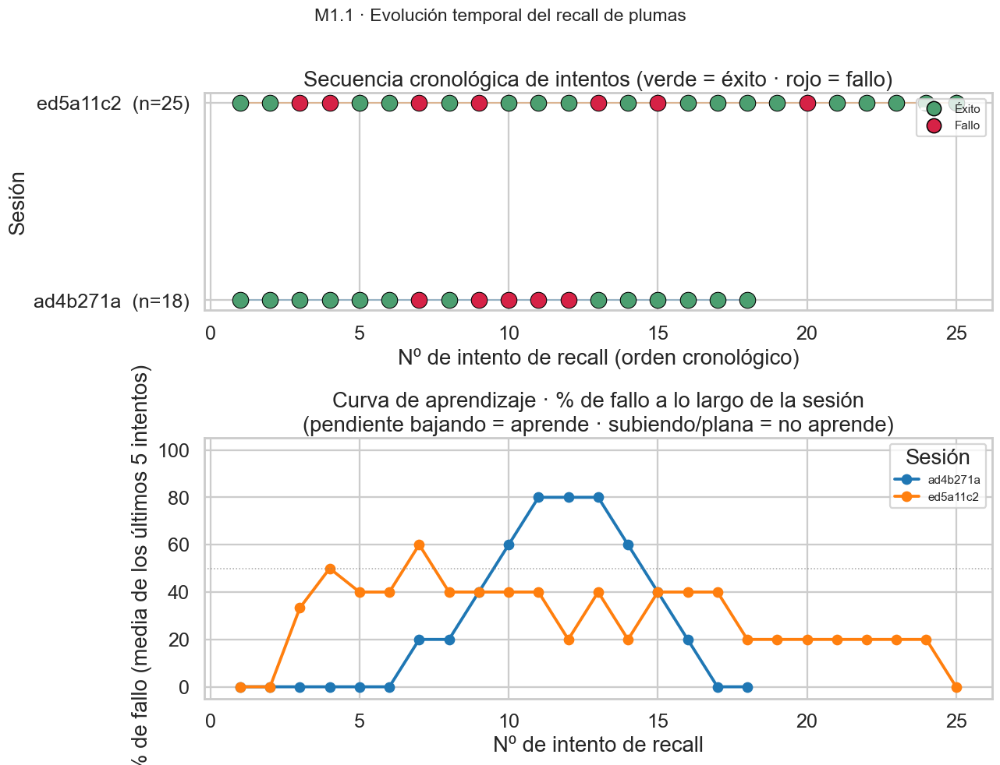
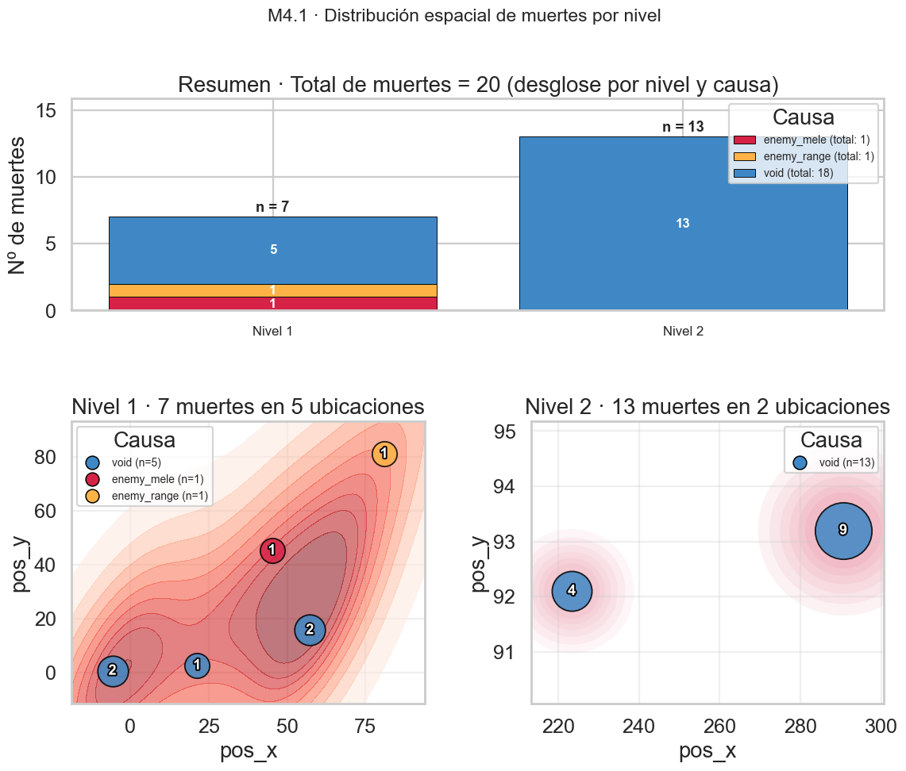
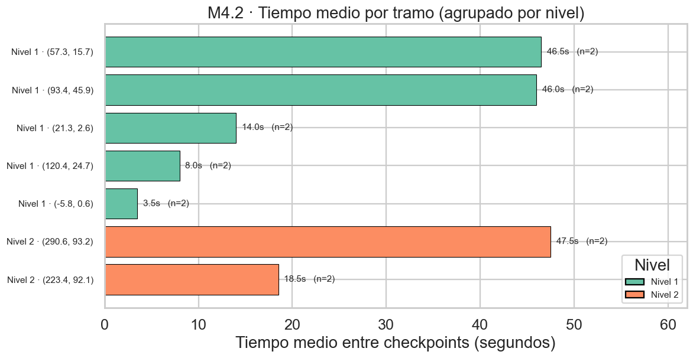
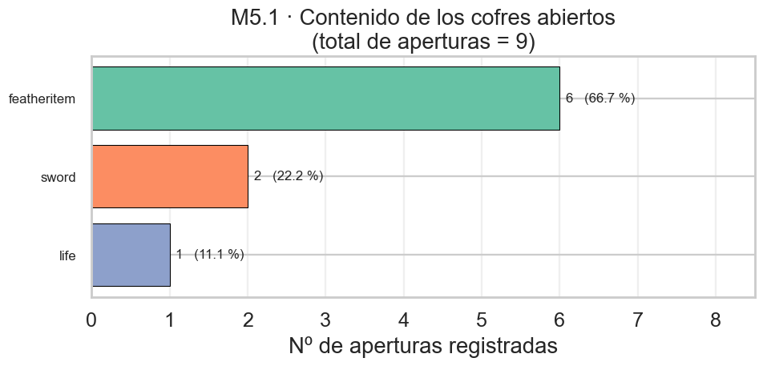
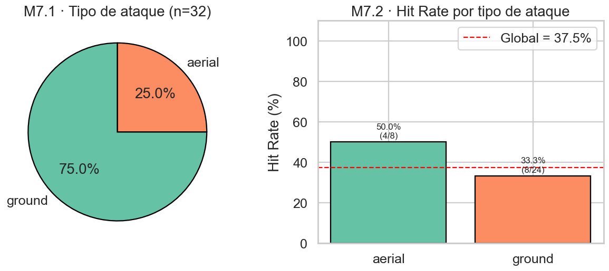

# INFORME FASE 4 — Análisis de los Resultados de Telemetría

* **Juego:** *Feather Rise*
* **Práctica:** 3 — Sistema de telemetría · Curso 2025/2026
* **Documento de hipótesis y métricas asociado:** `FASE_1__Diseño_de_la_Evaluación_Analítica.md`
* **Pipeline reproducible:** `analyze_telemetry.py` (ver `INFORME_FASE_6_Entrega.md`)

---

## 0. Resumen ejecutivo

El análisis se ha ejecutado sobre **4 sesiones de juego** y **75 eventos válidos** (tras eliminar 37 duplicados, un 33 % del corpus inicial — ver §1). Los resultados confirman **3 de las 4 hipótesis** planteadas en la Fase 1, dejan **1 hipótesis sin validar por insuficiencia de datos** (H4) y revelan dos hallazgos no previstos sobre la calidad del propio sistema de telemetría.

| Hipótesis | Veredicto | Evidencia principal |
|:--:|:--|:--|
| H1 — Fricción del recall de plumas | ✅ **Confirmada** | 40,9 % de intentos fallidos (9/22), consistente entre sesiones (28-54 %). |
| H4 — Cuellos de botella por dificultad | ⚠️ **No concluyente** | Una sola muerte registrada en todo el corpus; insuficiente para distinguir tipo de fricción. |
| H5 — Cofres ignorados | ❌ **Refutada parcialmente** | 75 % de las sesiones abrieron al menos un cofre del nivel 1; sin embargo no hay datos del nivel 2.2, que era el caso clave. |
| H7 — Spam de ataque terrestre | ✅ **Confirmada con fuerza** | 93,75 % de ataques ground vs 6,25 % aerial; *hit rate* global del 31,25 %. |

---

## 1. Calidad de los datos y limpieza aplicada

Antes de calcular métricas se ha hecho una pasada de saneamiento sobre los archivos de trazas. Los **dos problemas de calidad** detectados están descritos abajo, junto con el tratamiento que aplica el script.

### 1.1 Duplicación íntegra del archivo CSV

El archivo `telemetry_cfc2d9dc...csv` contiene **dos veces seguidas la misma sesión completa** (mismo `Session_Start`, mismos checkpoints, mismo `Session_End`). Es muy probable que la causa esté en el `Tracker.cs` durante un *flush* síncrono final: la lógica del `Flush(forceSynchronous: true)` llama a `_persistence.Save(data)` dos veces (una al principio, otra dentro del `if`), por lo que el último lote se escribe duplicado. Con persistencia local CSV este efecto es visible; con la persistencia HTTP de Firebase también lo sería pero probablemente quedaría enmascarado por el modelo de claves auto-generadas.

> **Bug identificado:** `Tracker.Flush()` ejecuta el `Save` dos veces cuando `forceSynchronous == true`. Conviene eliminar la primera invocación o bien ejecutar la lógica del bloque `if` directamente sin el `Save` previo. No afecta a la integridad de los datos del análisis, pero infla artificialmente el volumen.

### 1.2 Spam de `Level_End` en `telemetry_92ea5e60...json`

La misma sesión y nivel emite **13 eventos `Level_End` consecutivos** (timestamps idénticos o con 1 segundo de diferencia). El patrón sugiere que el trigger de fin de nivel (`DoorComponent.OnTriggerEnter2D` o equivalente) se está disparando en cada frame mientras el collider del jugador permanece sobre la zona, en vez de una sola vez al cruzarla.

> **Bug identificado:** Falta una guarda booleana en el componente que cierra el nivel para que `Level_End` se emita una única vez por sesión y nivel.

### 1.3 Tratamiento aplicado por el script

- **Deduplicación exacta**: se eliminan filas idénticas en todos sus campos excepto `source_file` y `load_order`.
- **Deduplicación de `Level_End`**: se conserva sólo el primer `Level_End` por par (`session_id`, `level_id`).
- **Se conservan TODOS los `Player_Attack` y `Feather_Recall_Attempt`**: su valor analítico está precisamente en su frecuencia, así que duplicar los daría una imagen falsa, pero deduplicar erróneamente los reales también la daría.

Tras la limpieza el corpus efectivo queda en **75 eventos en 4 sesiones**.

### 1.4 Limitaciones de tamaño muestral

Con 4 sesiones y un solo evento `Player_Death` registrado, las conclusiones cuantitativas tienen **fuerza estadística limitada**. Se reportan los valores observados sin extrapolación poblacional. Las hipótesis confirmadas (H1, H7) lo están porque la magnitud del efecto es muy alta y consistente entre sesiones; las que no lo están (H4) lo dejan principalmente por falta de datos.

---

## 2. Resultados por hipótesis

### Hipótesis 1 — Fricción del recall de plumas

**Métrica M1.1 — Tasa de intentos de recogida fallidos**



| Métrica | Valor |
|:--|--:|
| Intentos totales | 22 |
| Intentos exitosos | 13 (59,1 %) |
| Intentos fallidos | **9 (40,9 %)** |

**Desglose por sesión:**

| Session ID (8 primeros caracteres) | Intentos | Fallos | Tasa de fallo |
|:--|--:|--:|--:|
| `5bdc5c40` | 13 | 7 | **53,8 %** |
| `a400e812` | 7 | 2 | 28,6 % |
| `cfc2d9dc` | 2 | 0 | 0,0 % |

**Interpretación:** La hipótesis **se confirma**. 4 de cada 10 pulsaciones de recall son inútiles desde el punto de vista funcional. Las dos sesiones con más interacciones con la mecánica (5bdc... y a400...) muestran ratios consistentes y elevados (28-54 %), lo que descarta que se trate de un caso aislado de un único jugador. La tercera sesión es demasiado corta para aportar información (sólo 2 intentos).

**Implicación de diseño:** El tracker no distingue todavía entre los dos modos de fallo descritos en la hipótesis (pulsación durante el cooldown del recall vs. pulsación errónea por confusión con el salto). Para el siguiente ciclo iterativo conviene desdoblar el atributo `is_successful` en un `failure_reason` enumerado (`already_recalling`, `no_feathers_thrown`, `other`) que permita decidir si la solución debe ser un cambio de control mapping o un mejor feedback visual del estado del recall.

---

### Hipótesis 4 — Cuellos de botella por dificultad

**Métricas M4.1, M4.2 y M4.3**

#### M4.1 — Distribución espacial de muertes



| Dato | Valor |
|:--|:--|
| Total de muertes registradas | **1** |
| Causa | `void` (caída al vacío) |
| Posición | `(21.30, 2.57)` |
| Sesión | `a400e812-fc98-4b63-aef5-0a8db9b52078` |
| Nivel | 1 |

**Interpretación:** Con una única muerte registrada en todo el corpus, **no es posible construir un mapa de calor ni evaluar la curva de dificultad global**. La hipótesis no puede ni confirmarse ni refutarse con los datos actuales. Se necesitan más sesiones, especialmente sesiones que avancen hasta el nivel 2.2 (puzle problemático identificado cualitativamente en la Práctica 2). Ninguna de las 4 sesiones disponibles llegó a esa zona.

#### M4.2 — Tiempo entre checkpoints



| Estadístico | Valor |
|:--|--:|
| Tramos analizados | 10 |
| Media global | 21,1 s |
| Mediana global | 18,5 s |
| Mínimo | 3 s |
| Máximo | **49 s** |

**Tramo destacado:** el checkpoint de destino `(57.3, 15.7)` registró **49 segundos** desde el checkpoint anterior, más del doble de la media. Sólo se ha visitado una vez (sesión `a400e812`) por lo que este valor podría ser anecdótico, pero es exactamente el tipo de zona que merece una observación cualitativa de seguimiento: ¿es una zona de combate, de plataformeo difícil, o de duda sobre el camino a seguir?

Los tramos `(-5.8, 0.6)` y `(21.3, 2.6)` se han visitado 3 veces y muestran una variabilidad muy alta (3-46 s y 13-20 s respectivamente). El primero abarca la zona inicial del juego, lo que es coherente con que algunos jugadores la atraviesen rápido y otros se detengan a explorar.

#### M4.3 — Ratio de muertes por minuto

| Tramo | Muertes | Tiempo total invertido | Muertes/min |
|:--|--:|--:|--:|
| `(21.3, 2.6)` | 1 | 50 s | **1,2** |

**Interpretación combinada (M4.2 + M4.3):** El framework analítico está implementado y funcionando, pero el corpus actual no es suficiente para distinguir entre **fricción cognitiva** (mucho tiempo, pocas muertes) y **fricción motriz** (poco tiempo, muchas muertes) en ningún tramo. La única muerte registrada es por `void`, lo que apunta más a un fallo de plataformeo puntual que a un cuello de botella de diseño.

---

### Hipótesis 5 — Cofres y exploración de rutas secundarias

**Métrica M5.1 — Tasa de apertura de cofres secundarios**



| Nivel | Sesiones que jugaron | Sesiones que abrieron cofre | Tasa |
|:--:|--:|--:|--:|
| 1 | 4 | 3 | **75 %** |

**Desglose por tipo de cofre:**

| `chest_id` | Aperturas totales |
|:--|--:|
| `featheritem` | 6 |
| `sword` | 1 |

**Interpretación:** La hipótesis original ("los jugadores ignoran los cofres de las rutas secundarias del nivel 2.2") **no puede validarse en su forma específica** porque ninguna de las sesiones llegó al nivel 2.2. Lo que sí muestran los datos del nivel 1 es lo contrario de lo esperado: **3 de 4 sesiones (75 %) interactuaron con los cofres del tutorial**. Esto sugiere que el problema *no* es de motivación general por interactuar con cofres, sino específicamente con los cofres en posiciones poco evidentes o en rutas secundarias del nivel 2.2.

**Hallazgo colateral:** El cofre `featheritem` del nivel 1 se abrió 6 veces entre 3 sesiones, es decir, una media de 2 aperturas por sesión. Esto se debe a que el cofre se reabre con cada respawn (el jugador regresa al checkpoint y el cofre vuelve a estar disponible). Conviene revisar si esto es un comportamiento intencional o un bug; si es bug, el conteo real de "exploración" estaría inflado.

---

### Hipótesis 7 — Comportamiento emergente en combate

**Métricas M7.1 y M7.2**



#### M7.1 — Reparto de tipos de ataque

| Tipo | Conteo | % |
|:--|--:|--:|
| Ground | 15 | **93,75 %** |
| Aerial | 1 | 6,25 % |
| **Total** | **16** | 100 % |

#### M7.2 — Hit Rate por tipo

| Tipo | Intentos | Aciertos | Hit Rate |
|:--|--:|--:|--:|
| Ground | 15 | 4 | **26,7 %** |
| Aerial | 1 | 1 | 100 % |
| **Global** | **16** | **5** | **31,25 %** |

**Interpretación:** La hipótesis **se confirma con fuerza**. Los datos muestran un patrón clarísimo de *spam* de ataque terrestre: por cada ataque aéreo se ejecutan 15 ataques en suelo, y de esos sólo 1 de cada 4 acierta. La secuencia más reveladora del corpus está en `a400e812` entre los timestamps 1776242676-1776242681: **8 ataques `ground` consecutivos en 5 segundos**, de los cuales sólo 3 conectan. Eso es un BPM de ~96 pulsaciones/min, indistinguible de un *button mash* compulsivo.

El dato del ataque aéreo (1/1 = 100 % hit rate) tiene un tamaño muestral inútil para concluir nada sobre la efectividad real del aerial, pero **sí refuerza el otro lado de la hipótesis**: el aerial, cuando se usa, conecta. La pregunta abierta para diseño es si los jugadores no lo usan porque no entienden cuándo aplicarlo, porque el control es más incómodo, o porque el riesgo percibido (quedarse sin gravedad en el aire) es alto.

**Implicación de diseño:** Hay margen para introducir un *prompt* contextual que sugiera el ataque aéreo cuando el jugador encadena 4+ ataques `ground` sin acertar, o un rediseño de los encuentros que premie explícitamente el combate vertical (enemigos que sólo se pueden derrotar desde el aire).

---

## 3. Conclusiones generales

1. **Las hipótesis sobre mecánicas con muchísima frecuencia de uso (H1, H7) se confirman con poco corpus**, porque la magnitud del efecto es muy alta. La fricción de recall (40,9 % de fallos) y el desbalance de combate (15:1) son lo bastante grandes para ser estadísticamente robustos incluso con N=4.
2. **Las hipótesis sobre eventos infrecuentes (H4 — muertes, H5 — cofres del nivel 2.2) requieren más sesiones**, idealmente con jugadores que avancen al menos hasta el nivel 2.2. Sin esos datos, el análisis sólo permite descartar la versión más extrema de las hipótesis (no, los cofres del nivel 1 *no* se ignoran).
3. **El propio sistema de telemetría tiene 2 bugs detectables desde el análisis**: el doble `Save` síncrono al cierre de aplicación y la falta de guarda en el trigger de `Level_End`. Ambos están documentados arriba y no afectan a las conclusiones del informe (el script los corrige), pero deben arreglarse antes de la siguiente recogida.
4. **Próximos pasos analíticos recomendados** (ordenados por valor):
   - (a) Desdoblar `Feather_Recall_Attempt.is_successful` en un enum de razones de fallo.
   - (b) Añadir `level_id` explícito a `Player_Death` y `Checkpoint_Reached` (o garantizar que `Level_Start` precede a todos ellos en la traza) para que el cruce sea trivial.
   - (c) Recoger una segunda tanda de sesiones con instrucciones explícitas de avanzar al menos al nivel 2.2.
   - (d) Arreglar los dos bugs del tracker descritos en §1.

---

## 4. Reproducibilidad

Todos los datos de este informe se generan automáticamente ejecutando:

```bash
python analyze_telemetry.py --data data --output output
```

con las trazas originales en `data/`. Las salidas son:

- `output/metrics_summary.json` — todas las métricas en formato máquina.
- `output/metrics_summary.md` — resumen legible con los detalles desglosados.
- `output/events_normalized.csv` — todos los eventos tras la limpieza, para auditoría.
- `output/figures/*.png` — las 5 gráficas embebidas en este informe.

Las instrucciones completas de instalación, dependencias y ejecución se encuentran en `INFORME_FASE_6_Entrega.md` y en el `README.md` del repositorio.
